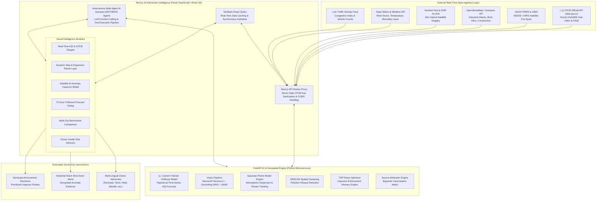

# AETHERIS — AI Urban Air Quality Intelligence Platform for Smart City Intervention

> **Theme:** Smart Cities / Environmental Intelligence / Geospatial Analytics / Public Health  
> **Track:** ET Smart Cities & Urban Environmental Intelligence Hackathon Challenge  
> **Tagline:** Moving from reactive monitoring to proactive, evidence-based urban air quality intervention.

---

## Executive Summary

India's air quality crisis is not isolated to Delhi — it is a severe national urban crisis affecting over 24 of India's top 50 cities across Tier-1 and Tier-2 urban centers. While India has deployed over 900 Continuous Ambient Air Quality Monitoring Stations (CAAQMS) under the National Clean Air Programme (NCAP), a **2024 CAG Audit revealed that only 31% of cities with monitoring data had actionable multi-agency response protocols linked to readings**.

**The monitoring data exists; the intelligence layer to convert readings into immediate physical intervention does not.**

**AETHERIS** bridges this critical gap by providing an end-to-end **AI-Powered Urban Air Quality Intelligence Platform**. It fuses real-time CPCB ground station feeds, high-resolution satellite remote sensing (Sentinel-2, ESRI), NASA MODIS/VIIRS thermal anomaly data, OpenStreetMap industrial land-use layers, live traffic density feeds, and meteorological forecasts into a unified decision engine.

Moving far beyond passive dashboard visualization, **AETHERIS** delivers:

1. **Geospatial Source Attribution Engine** (attributed by source category at ward level with confidence scores).
2. **Hyperlocal Predictive AQI Forecasting Agent** (Custom-trained XGBoost model calibrated to official CPCB NAQI).
3. **Enforcement Intelligence & Prioritization Agent** (DBSCAN hotspot detection & TSP inspector route optimization).
4. **Physics-Based Gaussian Plume Atmospheric Dispersion Engine** (steady-state downwind smoke/emission dispersion modeling).
5. **Satellite Vision Anomaly Scanner** (Microsoft Florence-2 + Grounding DINO + SAM2 for industrial stack/smoke detection).
6. **Multi-City Comparative Intelligence Dashboard** (benchmarking policy & intervention effectiveness across urban centers).
7. **Citizen Health Risk Advisory System** (personalized, multi-lingual health alerts in regional Indian languages).

---

## How AETHERIS Solves the Problem

| Urban Air Quality Problem            | Traditional Monitoring Approach                                                 | AETHERIS AI Solution                                                                                                                                       |
| :----------------------------------- | :------------------------------------------------------------------------------ | :--------------------------------------------------------------------------------------------------------------------------------------------------------- |
| **Data Silos & Protocol Gap**        | 69% of monitored cities lack multi-agency response protocols linked to readings | **Multi-Agency Action Layer:** Fuses CPCB, NASA FIRMS, OpenStreetMap, & Sentinel Hub into automated intervention triggers.                         |
| **Reactive Advisories**              | Issuing alerts _after_ AQI spikes to Severe/Hazardous levels                    | **Proactive 24–72h Forecasts:** Hyperlocal predictive AQI using a custom-trained **XGBoost** model calibrated to official CAAQMS baselines.                            |
| **Unknown Pollution Sources**        | Generic finger-pointing without spatial evidence                                | **Multi-Modal Source Attribution:** Correlates AQI against land-use maps, traffic density, industrial stacks, and thermal anomalies.                       |
| **Inefficient Inspection Routes**    | Random inspector deployment with minimal coverage                               | **DBSCAN + TSP Enforcement Routing:** Clusters high-risk pollution hotspots (AQI > 150) and computes optimal inspector itineraries.                        |
| **Untracked Plume Dispersion**       | Static radius estimates around monitoring stations                              | **Gaussian Plume Dispersion:** Physics-based plume simulation modeling downwind pollutant transport based on live wind vectors.                            |
| **Language & Communication Barrier** | Complex technical jargon delivered in English only                              | **Multi-Lingual Citizen System:** Translates health advisories into regional Indian languages (Kannada, Tamil, Hindi, Marathi, Bengali, Telugu, Gujarati). |

---

## Project Architecture Diagram

AETHERIS is built on a decoupled, microservice architecture pairing a high-performance **FastAPI AI Engine** with a responsive **Next.js 16 App Router Frontend**, orchestrated via an **Autonomous Multi-Agent AI system**.

---

## What Was Used & How It Was Used

### 1. **Frontend Stack & UI/UX Design System**

- **Next.js 16 (App Router)**: Framework for server-rendered components, React 19 hydration, and server API proxying. It securely isolates sensitive server-only API keys (e.g. CPCB `DATA_GOV_API_KEY`) away from the browser.
- **React 19 & TypeScript**: Provides end-to-end type safety across domain models, API routes, and agent tool payloads.
- **Tailwind CSS & Shadcn UI / Radix UI**: Design system featuring dark-mode visuals, responsive grid layouts, glassmorphism overlays, animated drawer modals, and accessible interactive primitives.
- **Recharts & Lucide Icons**: Customized SVG charts visualizing individual pollutant sub-indices (PM2.5, PM10, NO2, SO2, CO, O3) against official CPCB NAQI threshold bands.
- **TanStack React Query**: Manages query caching, background polling, and real-time state synchronization for station metrics.

### 2. **AI Engine & Machine Learning Stack (Backend)**

- **FastAPI & Uvicorn**: Asynchronous Python backend serving containerized AI foundation models with OpenAPI endpoints.
- **Custom-Trained XGBoost Model**: Machine learning regression model trained specifically for hyperlocal 24–72 hour AQI forecasting. Ingests historical CPCB reading sequences, meteorology, and pollutant trends to predict future AQI calibrated to official CPCB baselines.
- **Microsoft Florence-2 & Grounding DINO**: Multi-modal vision architecture applied to 10m high-resolution satellite imagery tiles to detect thermal anomalies, smoke plumes, open brick kilns, unpaved road dust, and industrial stack emissions.
- **Segment Anything Model 2 (SAM2)**: On-demand vision segmentation used to segment detected smoke plumes and industrial boundaries.

### 3. **Geospatial & Mathematical Analytics**

- **Pasquill-Gifford Gaussian Plume Atmospheric Dispersion Model**: Calculates steady-state downwind pollutant concentration $C(x,y,z)$ from industrial stacks based on atmospheric stability classes ($A$ to $F$):
  $$C(x,y,z) = \frac{Q}{2\pi u \sigma_y \sigma_z} \exp\left( \frac{-y^2}{2\sigma_y^2} \right) \left[ \exp\left( \frac{-(z-H)^2}{2\sigma_z^2} \right) + \exp\left( \frac{-(z+H)^2}{2\sigma_z^2} \right) \right]$$
- **DBSCAN Spatial Clustering**: Density-Based Spatial Clustering of Applications with Noise clusters spatial CAAQMS stations experiencing AQI > 150 into distinct hotspot zones.
- **Nearest-Neighbor Traveling Salesperson Problem (TSP) Solver**: Generates optimized patrol inspection routes for municipal enforcement teams starting from local municipal headquarters.
- **CPCB National Air Quality Index (NAQI) Math**: Sub-index linear interpolation based on CPCB's official 8-pollutant standard formula.

### 4. **External Data Feeds & APIs**

- **CPCB Data.gov.in API**: Real-time official Indian CAAQMS station monitoring feed.
- **NASA FIRMS & GIBS**: Near real-time MODIS/VIIRS thermal anomaly fire detections.
- **OpenStreetMap (Overpass API)**: Dynamic querying of surrounding industrial land-use tags, construction site counts, and road network classifications.
- **Sentinel Hub API & ESRI ArcGIS World Imagery**: Multispectral 10m optical satellite imagery tiles.

---

## Detailed Feature Breakdown

### 1. Geospatial Pollution Source Attribution Engine

Analyses local spatial-temporal AQI patterns against surrounding industrial land use (OpenStreetMap tags), vehicle traffic congestion levels, construction site densities, and satellite fire spots. It assigns percentage contribution weights to 4 primary source categories with statistical confidence scores:

- **Vehicular Emissions** (Traffic congestion & diesel transport corridors)
- **Industrial Emissions** (Factory stacks, brick kilns, & power plants)
- **Dust & Construction** (Unpaved roads, construction permits, & earthworks)
- **Biomass & Stubble Burning** (NASA satellite-detected thermal anomalies)

### 2. Hyperlocal Predictive AQI Forecasting Agent

Combines recent hourly CPCB ground station history with a custom-trained **XGBoost** model. It applies an official station calibration algorithm (`lib/forecast/official-calibration.ts`) to ensure predicted hourly trends match current official CPCB NAQI values, producing 24h to 72h forecasts at 1km grid resolution.

### 3. Enforcement Intelligence & Prioritization Agent

Uses **DBSCAN spatial clustering** to identify high-risk pollution clusters (AQI > 150). It correlates these clusters with nearby registered emission sources and computes an optimized **patrol inspection route** using Traveling Salesperson optimization, delivering prioritised itineraries for municipal pollution control authorities.

### 4. Physics-Based Atmospheric Dispersion Simulation

Simulates real-time downwind dispersion plumes using local wind vectors (wind speed & direction from weather feeds) and Pasquill-Gifford stability parameters. It renders semi-transparent gradient plume overlays directly on the map, allowing city administrators to trace industrial emissions across ward boundaries.

### 5. Multi-City Comparative Intelligence Dashboard

Enables city administrators to run side-by-side comparative analyses between urban centers (e.g., Delhi vs Mumbai, Bengaluru vs Chennai). Compares peak AQI, dominant pollutant profiles, source breakdowns, and effective enforcement intervention metrics.

### 6. Citizen Health Risk Advisory System

Maps population vulnerability indices based on current and forecast AQI. Translates health advisories into regional Indian languages (Kannada, Tamil, Hindi, Marathi, Bengali, Telugu, Gujarati) with tailored guidance for sensitive groups (elderly, children, outdoor workers, respiratory patients).

### 7. Autonomous Multi-Agent AI Assistant (AETHERIS Agent)

An interactive conversational assistant powered by dynamic function-calling tools:

- `show_forecast(lat, lon)`: Triggers 72h XGBoost forecasting.
- `show_hotspots(lat, lon, radius)`: Runs DBSCAN hotspot detection.
- `show_attribution(lat, lon)`: Calculates multi-modal source attribution.
- `show_dispersion(lat, lon)`: Simulates Gaussian dispersion plumes.
- `show_route(lat, lon)`: Calculates inspector patrol routes.
- `show_satellite(lat, lon)`: Conducts a 5-tile AI satellite anomaly scan.
- `compare_cities(city1, city2)`: Executes multi-city comparative analysis.

---
